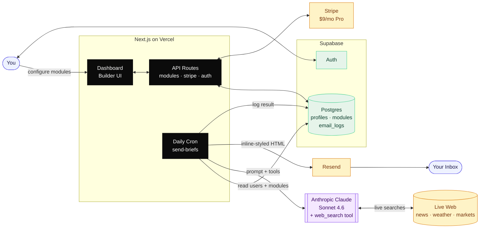
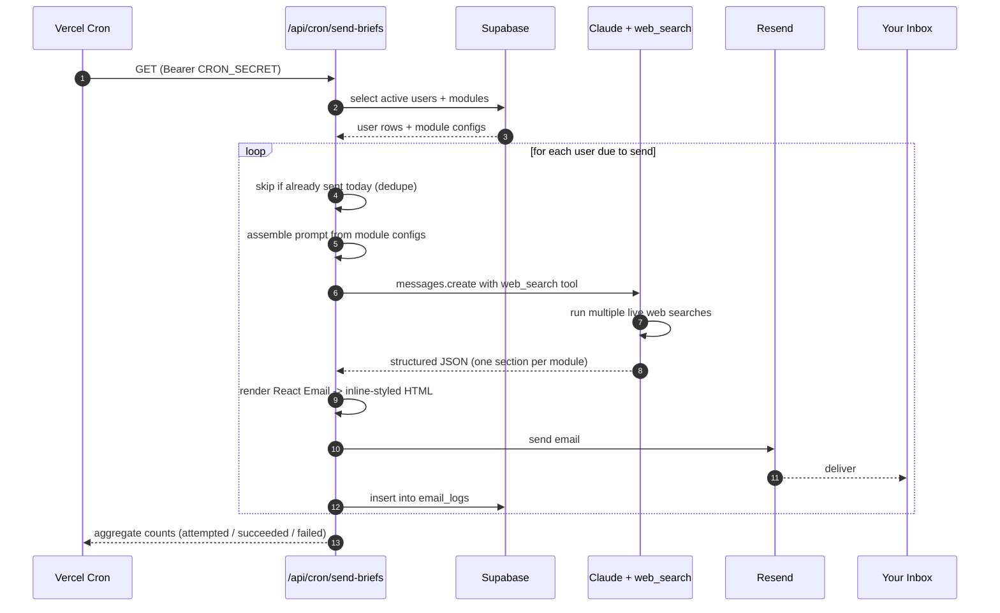

<div align="center">

# Daily Brief

**The morning newspaper, rebuilt for you.**

A daily email that you design. Pick what you want to read about — weather, markets, AI news, a workout, a stoic quote — and an AI researches it fresh every morning and delivers a single, beautifully formatted email to your inbox.

### [→ dailybriefmail.com](https://dailybriefmail.com)

</div>

---

## What it is

Daily Brief is a build-your-own newsletter. You don't subscribe to someone else's editorial taste — you subscribe to your own.

You assemble your brief from a library of modules. Each morning at the time you choose, an AI agent goes out to the live web, gathers the information for each module, writes it in your preferred tone and length, and emails it to you. No app to open. No feed to scroll. Just one email, in your inbox, before your coffee.

## Why it exists

Most "AI newsletters" are scheduled blasts written for an average reader. This one is generated *per user, per day* — your weather is your zip code's weather, your news is filtered to the topics you care about, your markets watchlist is the tickers you own. The brief is yours.

## What you can put in it

Mix and match from 20+ modules:

| Information | Lifestyle | Markets & Sports |
|---|---|---|
| Weather (multi-location) | Daily quote | Stock & crypto markets |
| News (filtered by topic & source) | Affirmation | Sports scores |
| AI / Tech news | Mindfulness moment | Currency exchange rates |
| Reddit highlights | Workout of the day | |
| Podcast picks | Recipe of the day | |
| On this day in history | Word of the day | |
| The week in history | Language phrase | |
| Random fact | Horoscope | |
| | Daily challenge | |
| | Book recommendation | |
| | Local events | |

Free plan: 3 modules. Pro plan ($9/mo): up to 12 modules, plus richer module options.

## How it works

1. **Sign up** at [dailybriefmail.com](https://dailybriefmail.com)
2. **Build your brief** — pick modules from the dashboard, configure each one (your city, your topics, your tickers)
3. **Pick a send time** — any time, any timezone
4. **Preview it** — send a test email to yourself anytime
5. **Wait for morning** — the brief lands in your inbox

That's the whole product.

## Under the hood

The interesting bit is how the email gets written. Every morning, a cron job picks up users due for delivery, loads each user's module configuration, and assembles a single prompt for Claude that describes — in natural language — exactly what to search for. Claude runs live web searches inside the API call, gathers real-time information, and returns a structured JSON response. The JSON is rendered into a clean, inline-styled HTML email and shipped through Resend.

The whole flow — from cron trigger to delivered email — runs in under a minute per user.

## Architecture

How the pieces fit together:



## What happens each morning



Steps 4 through 11 run in parallel across users via `Promise.allSettled`, so one user's failed search never blocks anyone else's brief.

## Stack

- **Next.js 14** (App Router) + **TypeScript** + **Tailwind** + **shadcn/ui**
- **Supabase** for auth and Postgres
- **Anthropic Claude** with the web search tool for content generation
- **Resend** + **React Email** for delivery and templating
- **Stripe** for subscriptions
- **Vercel** for hosting and cron

## Running it locally

```bash
git clone https://github.com/nate-bowers/agentmail.git
cd agentmail
npm install
cp .env.example .env.local   # fill in your keys
npm run dev
```

Required environment variables (see `ARCHITECTURE.md` for the full table):

- `NEXT_PUBLIC_SUPABASE_URL` / `NEXT_PUBLIC_SUPABASE_ANON_KEY` / `SUPABASE_SERVICE_ROLE_KEY`
- `ANTHROPIC_API_KEY`
- `RESEND_API_KEY`
- `STRIPE_SECRET_KEY` / `STRIPE_WEBHOOK_SECRET` / `NEXT_PUBLIC_STRIPE_PUBLISHABLE_KEY`
- `CRON_SECRET`

Database schema lives in `supabase/migrations/`. Run them in order against a fresh Supabase project.

## Adding a new module

The architecture is designed for this — each module is a single file that declares its config schema, a points cost, a natural-language search instruction, and an email renderer. Step-by-step checklist in [`ARCHITECTURE.md`](./ARCHITECTURE.md#part-8-how-to-add-a-new-module-checklist).

## Project layout

```
src/
  app/
    api/cron/send-briefs/   # the daily cron job
    api/modules/            # CRUD for user modules
    api/stripe/             # checkout + webhook
    dashboard/              # the builder UI
  components/
    dashboard/              # builder Sheet, module cards
    email/DailyBriefEmail   # the email template (inline-styled React Email)
    modules/forms/          # per-module config forms
  lib/
    modules/                # one file per module type
    email/generate.ts       # Claude prompt assembly + JSON extraction
    email/themes.ts         # email color themes
supabase/migrations/        # database schema
```

## Status

Live in production at [dailybriefmail.com](https://dailybriefmail.com). Sending real briefs to real users.

## License

Private project — not currently open for contributions.

---

<div align="center">
Built by <a href="https://github.com/nate-bowers">Nate Bowers</a>
</div>
